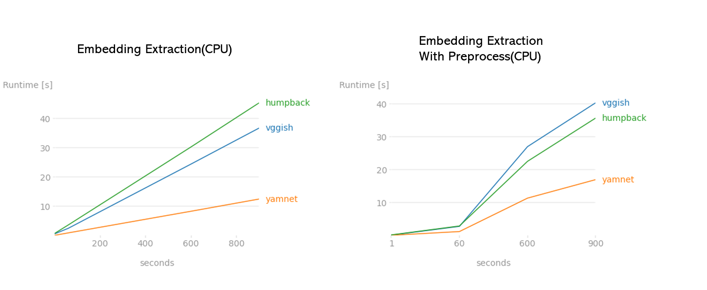
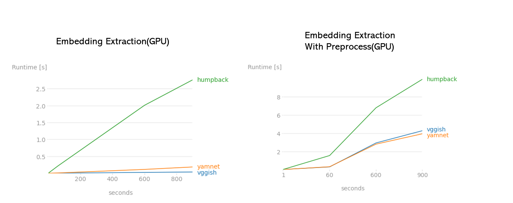

# orca-embeddings
extraction pipelines and experiments with audio embeddings. The models used in this repo are [Vggish](https://tfhub.dev/google/vggish/1), [Yamnet](https://tfhub.dev/google/yamnet/1) and [Humbpack whale model](https://tfhub.dev/google/humpback_whale/1), each model requires the waveform to have an appropiate sample rate and tensor shape.

| model | sample rate | input representation | window size        | embedding size |
|-------|-------------|----------------------|--------------------|----------------|
|Vggish | 16 Khz      | Log-mel Spectrogram  | 0.96 s (no overlap)| 128            |
|Yamnet | 16 Khz      | Log-mel Spectrogram  | 0.96 s (0.48s hop) | 1024           |
|Humpack Whale| 10 Khz| Pcen Spectrogram     | 3.84 s             | 2048           |

# Usage

The extraction function receives an audio file and a string with the model name('vggish','yamnet','humpback'). Returns the embedding and time-frequency representation that the model uses as input. 

## Embedding projector

A really great tool to visualize embeddings, is the [embedding projector](https://projector.tensorflow.org/). You can run this tool either locally with tensorboard or directly uploading your files to a public accesible cloud resource. The embedding projector needs 3 files to do the complete visualization and 1 config file:

* .tsv file where each row is a point represented in a N-dimensional space defined from the number of columns.
* .tsv file with metadata for each of the points, first row must be the header with column labels.
* .jpg or .png sprite image, that should be in the same order as the previous files.
* .json config file that contains the paths to the previous files.

An example of the Json config file is the following one, in addition to the Urls of the public hosted files you must name your tensor and also provide the dimensions of a single image in the sprite file. 

```json
{
    "embeddings": [
      {
        "tensorName": "Orcasound",
        "tensorShape": [
          4900,
          128
        ],
        "tensorPath": "https://t3st-jos3.s3.us-east-2.amazonaws.com/embeddings_v3.tsv",
        "metadataPath": "https://t3st-jos3.s3.us-east-2.amazonaws.com/metadata_vggish.tsv",
        "sprite": {
          "imagePath": "https://t3st-jos3.s3.us-east-2.amazonaws.com/sprite.jpg",
          "singleImageDim": [
            100,
            100
          ]
        }
      }
    ]
  }

```
Then you pass the route of your json file to the url of the projector and the projector should load your files. 

```
https://projector.tensorflow.org/?config=path_to_your_json_config_file
```

If the projector don't load your data you must assure to enable The CORS policy on your cloud resource, [more on this issue](https://github.com/tensorflow/tensorflow/issues/16770)

If you are using S3, Just add Cors rule via json file under permissions tab

```json
[ { "AllowedHeaders": [], "AllowedMethods": [ "GET" ], "AllowedOrigins": [ "*" ], "ExposeHeaders": [] } ]
```

This example in colab generates the files for the projector on a single audio file and loads the tensorboard extensions within the notebook to visualize the embeddings directly on the colab notebook. Sometimes you have to delete the logs folder and re-run the cell of the projector if the extension can't find the tensor data.
[](https://colab.research.google.com/drive/1tAoBD-WbXa1PFPd0J598xxWlvZJxgCl4?usp=sharing)

# Online Experiments

Using this workflow a projector visualization for each of the embedding models was generated using the train dataset of the [Orcaml repo](https://github.com/orcasound/orcaml#Examples), you can see in the notebook folder how the files were generated although they're very similar to the colab example and just differ in the metadata generation. 

* [Vggish embeddings](https://projector.tensorflow.org/?config=https://t3st-jos3.s3.us-east-2.amazonaws.com/projector_config.json)
* [Yamnet embeddings](https://projector.tensorflow.org/?config=https://t3st-jos3.s3.us-east-2.amazonaws.com/yamnet_embeddings/yamnet_config.json)
* [Humpback embeddings](https://projector.tensorflow.org/?config=https://t3st-jos3.s3.us-east-2.amazonaws.com/humpback_embeddings/humpback_config.json)

# Performance

Using perfplot some test were carried to test the embedding extraction in a colab environment with and without GPU. Test are from audios that range from 1 second to 15 minutes in durations. For the Cpu case a 15 minute audio takes abouit 40 second to process with the humpback model so theres a 22.5X processing wrt the audio duration and the best case is for the Yamnet model with 18 seconds for 50x.



Using the GPU speeds up the processing of the embeddings, where only the extraction phase is done on less than a second for the vggish and yamnet model and with the whole preprocess is done in 4 seconds. 



You can try the colab notebook

[](https://colab.research.google.com/drive/1N0GyccpGkEiuaZj-Kli_a7yxEobav4_B?usp=sharing)


